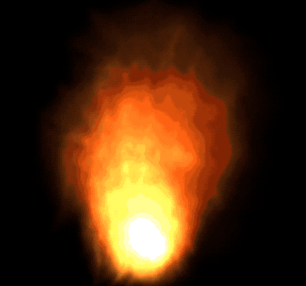

# bonfire
A naive particle system simulating the fire.

## Demo

## Reference
- W. T. Reeves. Particle systems: a technique for modeling a class of fuzzyobjects. ACM Trans. Graph., 2(2):91–108, 1983.
- WANG Zhi-gang, CHEN He-ping, LIU Xin-xiong. The simulation of Flame Based on Particle System and Texture Mapping. Journal of Engineering Graphics, 4: 49-53, 2002.
- T.S. Lyes, K. A. Hawick. Fire and Flame Simulation using Particle Systems Graphical Processing Units. 2013.

## License
MIT
